# 

# Đồ án Nhóm 8 - Trang web nấu ăn - Letmecook

## Chào mọi người đến với đồ án Web của nhóm chúng mình

### I. Thành viên nhóm:
```
   Nguyễn Tài Hiếu - 22520442
   Võ Nhật Hoàng - 22520481
   Trần Thị Phương Thảo - 22521375
   Đinh Quốc Huy - 22520536
   Trần Hữu Hiếu - 22520444
```
### II. Setup môi trường react js:
- Trong giao diện terminal:
- Tạo một thư mục để chứa code `mkdir Temp_Up_Web`:
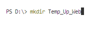
- `cd Temp_Up_Web`
- Tải các package cần thiết
```npx create-react-app .``` hoặc ```npm install```
- Các package cần thiết để chạy trên mobile:
  - `npm i -S bootstrap`
  - `npm i -S react-scripts`
  - `npm install react-bootstrap-validation --save`

- Sau khi tải thì sẽ xuất hiện folder `node_modules` (cùng các file ban đầu nếu dùng npx create-react-app):

<p align="center">
  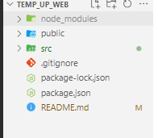
  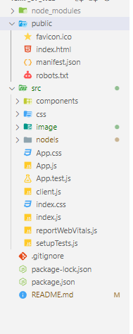
</p>

- Folder public chúng ta chú ý vào file `html.index` đảm nhiệm trang chính
- Trong folder src gồm các Components, css, image cơ bản và nodels chứa file `server.js` -file config để kết nối với database center
- Khi chạy thử ở local ta sẽ chạy `npm start` ngay trong folder Temp_Up_Web:


<p align="center">
    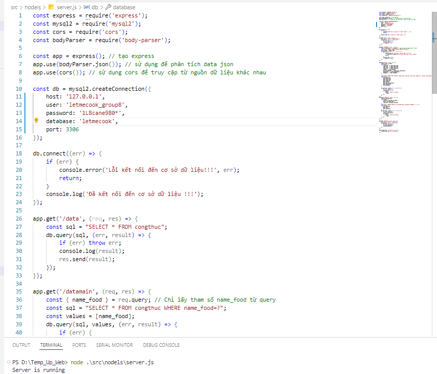
</p>

- Sau đó ở trình duyệt sẽ tự động bật lên trang chủ của trang web và database sẽ chạy ở local:

<p align="center">
    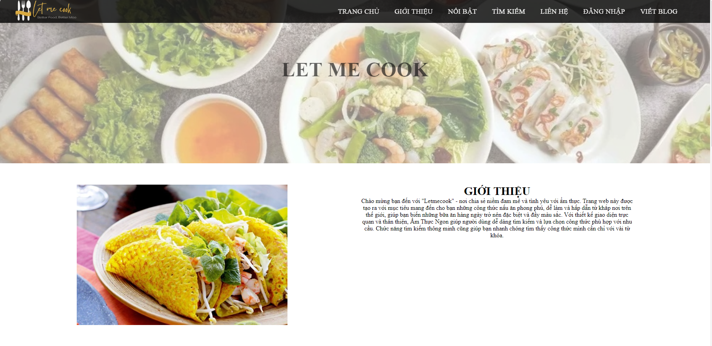
</p>

###
### III. Các chức năng chính của trang web:
- Route và Linker:
  - Linker: <p align="center">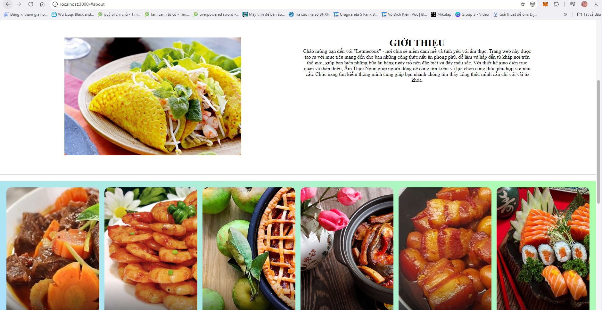</p>

  - Route: Ví dụ `localhost:3000/login` <p align="center">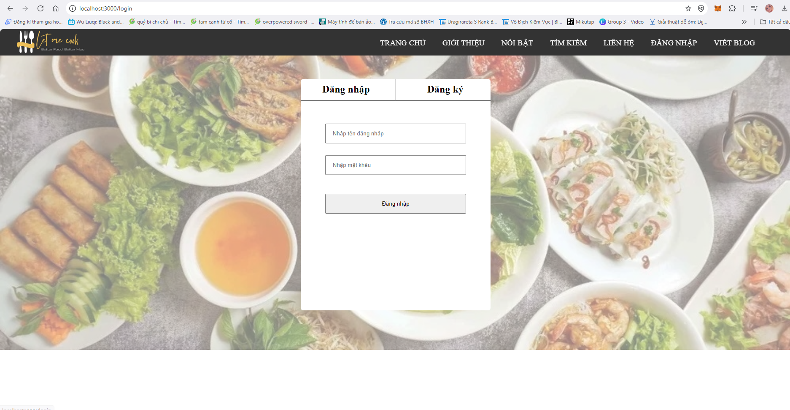</p>

- Đăng nhập và đăng kí:

<p> 

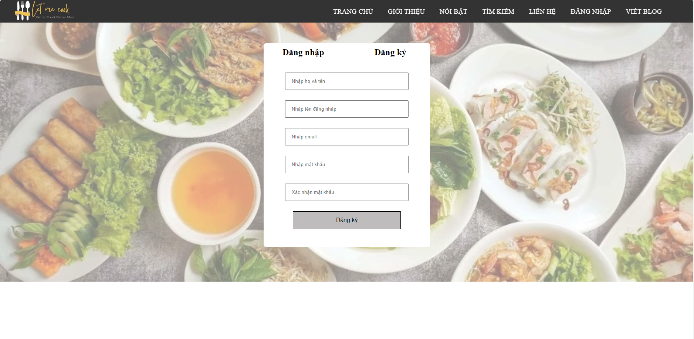
</p>

- Trang tìm kiếm món ăn - Tìm kiếm theo nguyên liệu ban đầu, thời gian nấu và theo tên món:

<p> 
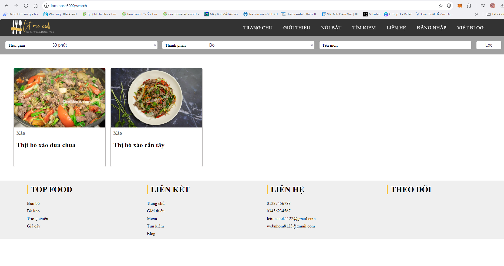
</p>

- Người dùng tự thêm món ăn:
<p> 
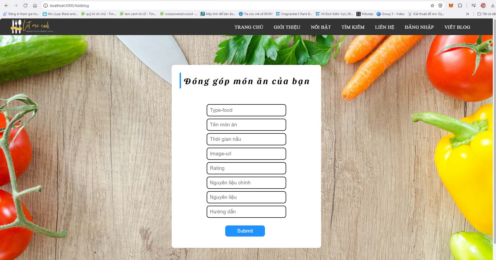
</p>


### IV. Domain đã deploy:
- Nhóm 8 tụi mình quyết định deploy trên `netlify app`.

># [Link Domain](Link_Domain)
`https://master--letmecooker.netlify.app/?fbclid=IwZXh0bgNhZW0CMTAAAR1WtmJEvHcAUWrwWe2xa3lNivzoLoJM1Xi7-n8IMk89BOrQgB2b0mXyp-Q_aem_AcTFOQGQZ_6e8KWQQ_3jNVNnCiuWmK2xLE7XkYk_zVHhxk1wKZAHPd-ZKWp1Rcs6AU1-HOssUgSbvDITS8sShaP8`

<p>
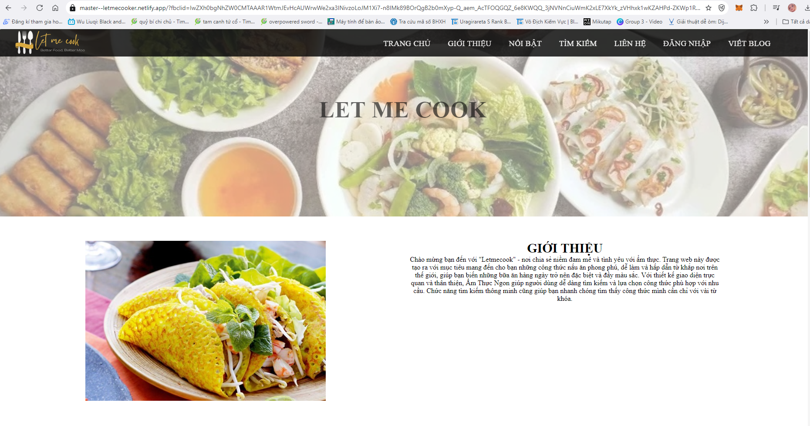
</p>


### III. Link Github & Video Demo:
>## [Link repository github của nhóm][Link_Github]

>## [Link Video Demo Serminar giữa kì][Link_Video]

{@youtube: https://www.youtube.com/watch?v=6plAlNpjsPE }

[Link_Video]: https://www.youtube.com/watch?v=6plAlNpjsPE
[Link_Github]: https://github.com/Let-Me-Cook-Group-8/LET-ME-COOK
[Link_Domain]: https://master--letmecooker.netlify.app/?fbclid=IwZXh0bgNhZW0CMTAAAR1WtmJEvHcAUWrwWe2xa3lNivzoLoJM1Xi7-n8IMk89BOrQgB2b0mXyp-Q_aem_AcTFOQGQZ_6e8KWQQ_3jNVNnCiuWmK2xLE7XkYk_zVHhxk1wKZAHPd-ZKWp1Rcs6AU1-HOssUgSbvDITS8sShaP8